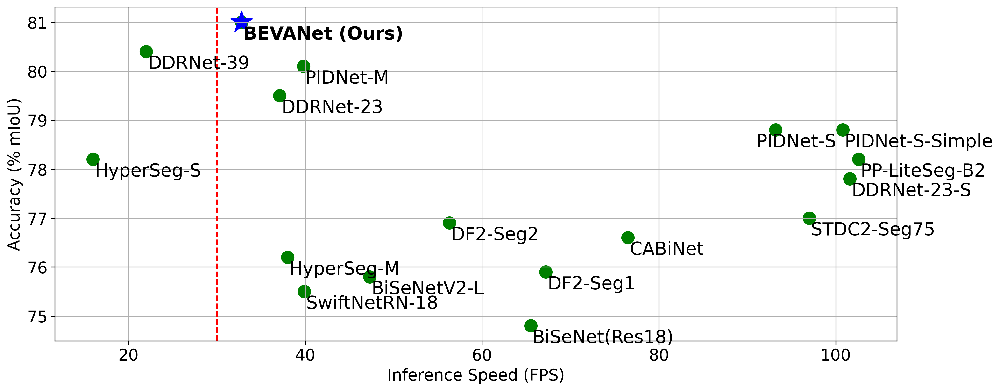
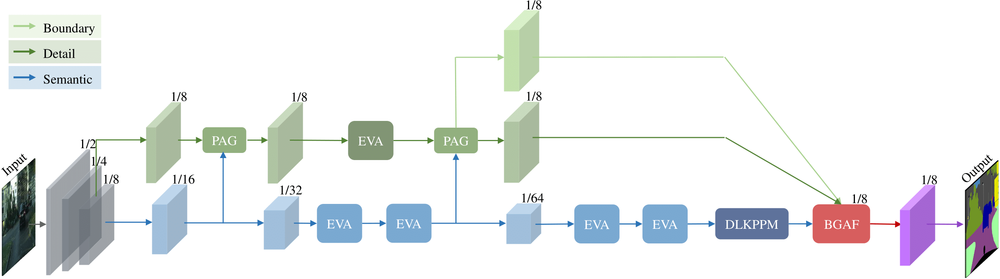
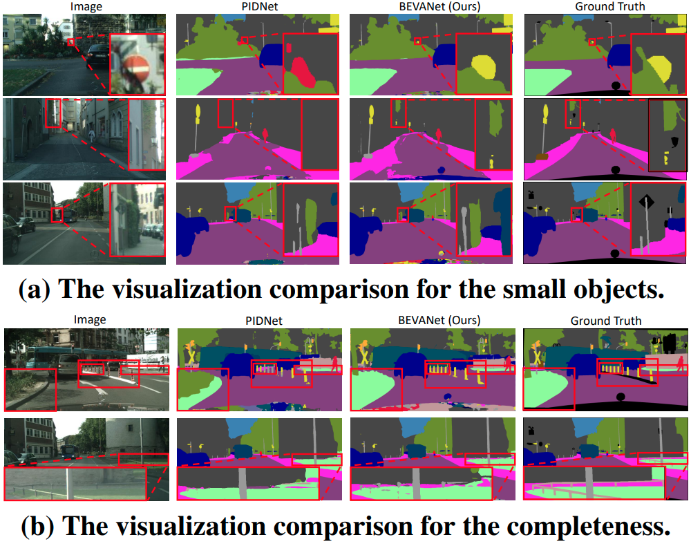

# BEVANet: Bilateral Efficient Visual Attention Network for Real-time Semantic Segmentation

[](https://opensource.org/licenses/MIT)

This is the official repository for BEVANet (ICIP 2025 spotlight).

## Highlights
<p align="center">
  </br>
  <span align="center"> Comparison of inference speed and accuracy for real-time models on Cityscapes validation set.</span> 
</p>

* **Efficient Attention Mechanisms**: We leverage large kernel attention to design the EVA block, SDLSKA, CKS, and DLKPPM modules. These components enlarge and dynamically adjust receptive fields, enhance feature representation, capture contextual information,and refine object details, improving spatial modeling.
* **Branch Interaction**: Frequent communication between high- and low-level branches through the bilateral architecture and the BGAF module enhances semantic concepts and detail contour by sharing information, enabling adaptive feature fusion.
* **Performance**: BEVANet offers a superior balance of
speed and accuracy to existing models.It achieves real-time segmentation over 30 FPS with 81.0\% mIoU in Cityscapes after pre-training on ImageNet and maintains 79.3\% mIoU without pre-training, showing less dependency on large pre-training datasets. Its variant BEVANet-S further achieves 83\% mIoU on CamVid, demonstrating its scalability.

## Overview
<p align="center">
  </br>
  <span align="center">An overall architecture of our proposed Bilateral Efficient Visual Attention Network (BEVANet). </span> 
</p>

## Demo
<p align="center">
  </br>
  <span align="center">The visualization results. </span> 
</p>

## Models
We provide ImageNet pretrained models here to facilitate reproduction.

| Model (ImageNet) | Acc@1 | Acc@5 | Param (M) | FPS@RTX4090 |
|:-:|:-:|:-:|:-:|:-:|
| [BEVANet-S](https://drive.google.com/file/d/1adaWjRHfoS97lxyEZHkM0vOn_1KFbI7j/view?usp=sharing) | 71.1 | 90.1 | 16.3 | 198.6 |
| [BEVANet](https://drive.google.com/file/d/1klSGNlUs6h7FHJ_lvOvKQEyzeWx_wrd0/view?usp=sharing) | 76.3 | 93.0 | 57.4 | 82.3 |

Additionally, the finetuned models on Cityscapes, CamVid, and ADE20k are available for direct deployment.

| Model (Cityscapes) | Val (% mIOU) | Param (M) | FPS@RTX3090 |
|:-:|:-:|:-:|:-:|
| [BEVANet-S](https://drive.google.com/file/d/1tk8vNr4t9qK481uid65NCj0fPvjLIBRk/view?usp=sharing) | 78.2 | 15.2 | 70.0 |
| [BEVANet](https://drive.google.com/file/d/1IxKY85Yx418Q8FmiI2tGj0-TrGahuUxe/view?usp=sharing) | 81.0 | 58.6 | 32.8 |

| Model (CamVid) | Val (% mIOU) | Param (M) | FLOPs (G) | FPS@RTX3090 |
|:-:|:-:|:-:|:-:|:-:|
| [BEVANet-S](https://drive.google.com/file/d/1mcWyBpG-NyG0-i7uS17si1CCb1QiFyNn/view?usp=sharing) | 83.1 | 15.2 | 20.1 | 79.4 |

| Model (ADE20k) | Val (% mIOU) | Param (M) | FPS@RTX3090 |
|:-:|:-:|:-:|:-:|
| [BEVANet](https://drive.google.com/file/d/1WxXegdi1XgKDGj0CQvvYK4NdWm7XxCVp/view?usp=sharing) | 39.8 | 58.9 | 73.3 |

## Prerequisites
This implementation is adapted by [PIDNet](https://github.com/XuJiacong/PIDNet). Please refer to its repository for installation and dataset preparation. 

## Usage

### 0. Prepare the dataset

* (Optional) Download the [ImageNet](https://image-net.org/download.php) dataset and unzip it into `data/ImageNet` directory.
* Download the [Cityscapes](https://www.cityscapes-dataset.com/), [CamVid](http://mi.eng.cam.ac.uk/research/projects/VideoRec/CamVid/), and [ADE20k](https://ade20k.csail.mit.edu/) datasets, extracting them to `data/cityscapes`, `data/camvid`, and `data/ade20k` dirs, respectively.
* Ensure that the file paths listed in `data/list` correctly correspond to the dataset images.

### 1. Pretraining (Optional)
* For example, pretrain the BEVANet on ImageNet:
````bash
python tools/pretrain.py --cfg configs/cityscapes/BEVANet.yaml
````

### 2. Training

* Pretrain with step 1. or download the ImageNet pretrained models and put them into `pretrained_models/ImageNet/` directory.
* For example, finetune the BEVANet on Cityscapes:
````bash
python tools/train.py --cfg configs/cityscapes/BEVANet.yaml MODEL.PRETRAINED pretrained_models/imagenet/BEVANet_ImageNet.pth
````
* Or train the BEVANet from scratch on Cityscapes with batch size of 12 on 2 GPUs:
````bash
python tools/train.py --cfg configs/cityscapes/BEVANet.yaml ENV.GPUS (0,1) TRAIN.BATCH_SIZE_PER_GPU 6
````
* Or train the BEVANet from scratch on Cityscapes using train and val sets simultaneously with batch size of 12 on 4 GPUs:
````bash
python tools/train.py --cfg configs/cityscapes/BEVANet_trainval.yaml GPUS (0,1,2,3) TRAIN.BATCH_SIZE_PER_GPU 3
````

### 3. Evaluation

* Download the finetuned models for Cityscapes, CamVid, and ADE20k and put them into `checkpoint/cityscapes/`, `checkpoint/ADE20k/`, `checkpoint/COCO/` and `checkpoint/camvid/` directories, respectively.
* For example, evaluate the BEVANet on Cityscapes val set:
````bash
python tools/eval.py --cfg configs/cityscapes/BEVANet.yaml \
                          TEST.MODEL_FILE checkpoint/cityscapes/BEVANet_VAL_Cityscapes.pt \
                          DATASET.TEST_SET list/cityscapes/val.lst
````
* Or, evaluate the BEVANet-S on CamVid val set:
````bash
python tools/eval.py --cfg configs/camvid/BEVANet_S.yaml \
                          TEST.MODEL_FILE checkpoint/camvid/BEVANet_S_VAL_Camvid.pt \
                          DATASET.TEST_SET list/camvid/val.lst
````
* Or, evaluate the BEVANet on ADE20k val set:
````bash
python tools/eval.py --cfg configs/ade20k/BEVANet.yaml \
                          TEST.MODEL_FILE checkpoint/ade20k/BEVANet_VAL_ADE20k.pt \
                          DATASET.TEST_SET list/ade20k/val.lst
````
* Generate the testing results of BEVANet on Cityscapes test set:
````bash
python tools/eval.py --cfg configs/cityscapes/BEVANet.yaml \
                          TEST.MODEL_FILE checkpoint/cityscapes/BEVANet_TEST_Cityscapes.pt \
                          DATASET.TEST_SET list/cityscapes/test.lst
````

### 4. Speed Measurement

* Measure the inference speed of BEVANet for Cityscapes:
````bash
python models/speed/BEVANet_speed.py --cfg configs/cityscapes/BEVANet.yaml --c 19 --r 1024 2048
````
* Measure the inference speed of BEVANet-S for CamVid:
````bash
python models/speed/BEVANet_speed.py --cfg configs/camvid/BEVANet_S.yaml --c 11 --r 720 960
````

### 5. Custom Inputs


* Place all your images in the `samples/` directory, then run the following command using the Cityscapes pretrained PIDNet-L model for .png image format:
````bash
python tools/custom.py --cfg configs/cityscapes/BEVANet.yaml --p 'checkpoint/cityscapes/BEVANet_VAL_Cityscapes.pt' --t '.png'
````
## Acknowledgement

* Our implementation is modified based on [PIDNet](https://github.com/XuJiacong/PIDNet).